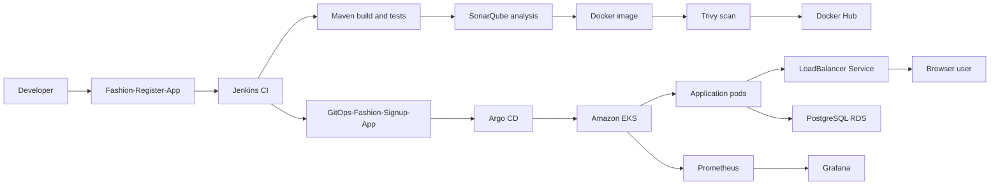

# Architecture Overview

## System Context

The Fashion Signup App is a Java web application deployed to Amazon EKS. Application source and deployment configuration are maintained in separate Git repositories.

## End-to-End Flow

## Repository Boundaries

### Application repository

`Fashion-Register-App` contains the Java source, Maven modules, Dockerfile, web assets, tests, and Jenkinsfile.

### GitOps repository

`GitOps-Fashion-Signup-App` contains the Helm chart, deployment values, Deployment template, and Service template. It defines the desired Kubernetes state.

## Runtime Components

| Component | Responsibility |
| --- | --- |
| Jenkins | Builds, tests, scans, packages, and updates the GitOps image tag |
| Docker Hub | Stores versioned application images |
| Argo CD | Reconciles GitOps configuration with the EKS cluster |
| Amazon EKS | Runs and rolls out the application pods |
| LoadBalancer Service | Provides the external application endpoint |
| PostgreSQL RDS | Stores application data |
| Kubernetes Secret | Supplies database connection values to pods |
| Prometheus and Grafana | Collects and presents operational metrics |

## Traffic and Data Flow

The Kubernetes Service receives external traffic on port `8080` and forwards it to application pods on their container port. The application reads `DB_URL`, `DB_USER`, and `DB_PASSWORD` from the `register-app-db` Secret and connects to PostgreSQL RDS.

## Ownership Model

- Jenkins owns CI and the GitOps commit.
- GitHub stores source and desired deployment state.
- Argo CD owns Git-to-cluster reconciliation.
- Kubernetes owns scheduling, rollout, and Service routing.
- RDS owns persistent relational data.
